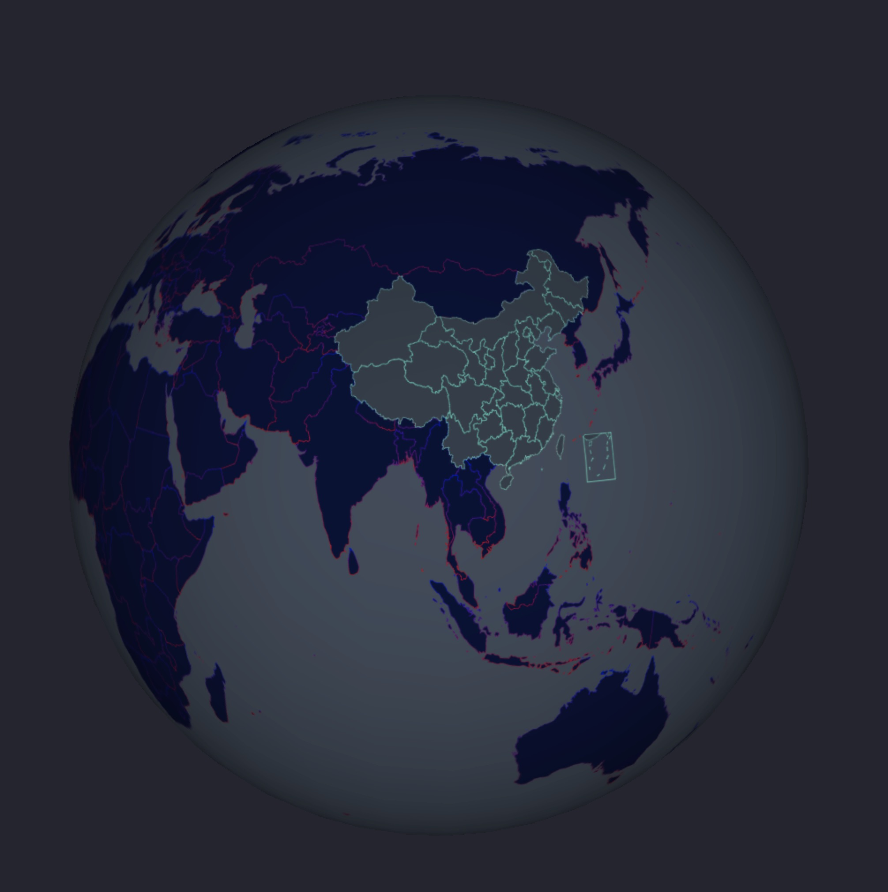

## 一颗被病毒感染的地球

#### 用 中国地图和世界地图的 geoJson 数据，基于 Three.js + echarts(V3.8.5) 实现的三维地图
[LIVE DEMO](https://jiangyuzhen.github.io/GeoJson-Three-Earth/)

#### 实现的原理:
```
1、使用 echarts 画好世界地图(canvas)

2、把画好的地图贴到三维的球体上

```
#### 需要注意的点：
1、想要中国地图顺利嵌进世界地图，千万别忘了一下代码，否则你会发现你的地图 “出乎想象”
```
boundingCoords: [
    // 定位左上角经纬度
    [-180, 90],
    // 定位右下角经纬度
    [180, -90]
]
```

2、注意 echarts 的版本

3、你肯定不想你的地球还有点奇怪的节奏感
```
mapTexture.needsUpdate = true;

// 选中或移出时才更新贴图
// 内存向显存上传数据很慢，应该尽量减少贴图更新
chart.on('mouseover', function () {
    mapTexture.needsUpdate = true;
}

chart.on('mouseout', function () {
    mapTexture.needsUpdate = true;
});
```

#### 效果图


